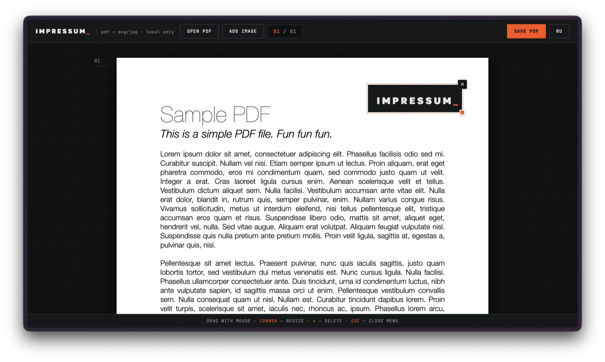

# Impressum_

**Stamp images and signatures onto PDFs right in your browser.** A single HTML file, nothing to install, no server — your documents never leave your computer.

*Impressum* (Latin) — "an imprint, that which is pressed in."



## Features

- Open a PDF with a button or by dragging the file into the window
- Add images (PNG/JPG) — as many as you like, on any pages
- Drag with mouse or finger, resize by the corner handle with aspect ratio preserved
- Insert at the exact click point via the context menu (right-click on desktop, long-press on mobile)
- All pages in a continuous vertical scroll with a current-page indicator
- Delete with confirmation: the ✕ button, the menu item, or Delete/Backspace
- Save the result as a new PDF (`name-signed.pdf`) — images are embedded into the document
- Russian and English UI, toggled with a button, choice is remembered
- Mobile-friendly: compact header, larger touch targets, long-press instead of right-click

Live: **[sign.vinaes.co](https://sign.vinaes.co/)**

## Running

Open `index.html` in a browser. That's it.

To access it from a phone over the local network:

```sh
python3 -m http.server 8000
# then on the phone: http://<computer-IP>:8000
```

### Docker

```sh
docker compose up -d --build
# serves on http://localhost:47812
```

nginx:alpine serving `index.html` and the OG image; `index.html` is sent with `no-cache` so updates apply on rebuild without stale clients.

## Controls

| Action | Desktop | Mobile |
|---|---|---|
| Open a PDF | button or drag & drop the file | button |
| Add an image | button, drag & drop a PNG/JPG, right-click → "Choose an image…" | button, long-press on a page |
| Move | drag with the mouse | drag with a finger |
| Resize | pull the orange corner handle | same |
| Delete | ✕, Delete/Backspace, right-click → "Delete image" | ✕, long-press on the image |
| Close the menu | Esc, click elsewhere | tap elsewhere |

## How it works

- **[pdf.js](https://mozilla.github.io/pdf.js/)** renders page previews (canvas, devicePixelRatio-aware)
- **[pdf-lib](https://pdf-lib.js.org/)** embeds the images into the original PDF on save
- Positions are stored in PDF points from the top-left corner of each page; on save the Y axis is flipped (PDF's origin is the bottom-left corner)
- Both libraries are loaded from CDNs; fonts come from Google Fonts (Golos Text + JetBrains Mono)

## Privacy

All processing happens in the browser's memory. The network is used once — to fetch the libraries and fonts from CDNs when the page opens. Your PDFs and images are never uploaded anywhere.

## Limitations

- Internet is required the first time the page opens (CDNs); for full offline use, put the libraries and fonts next to `index.html`
- Rotated pages (common in scans) are not handled yet — image placement may be off on them
- All pages render at once: the initial render of documents with hundreds of pages can take a moment
